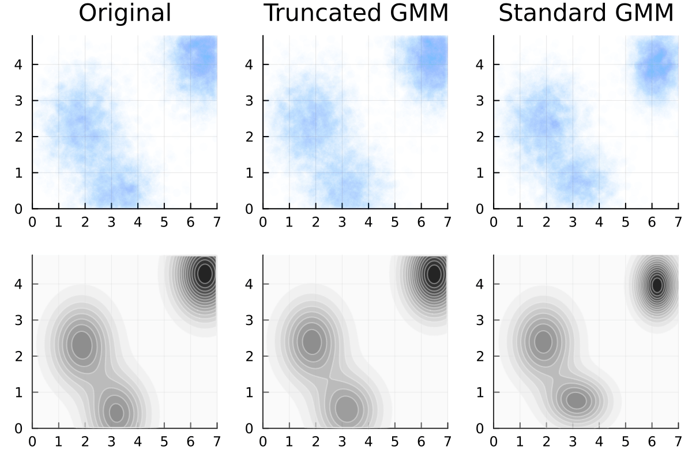
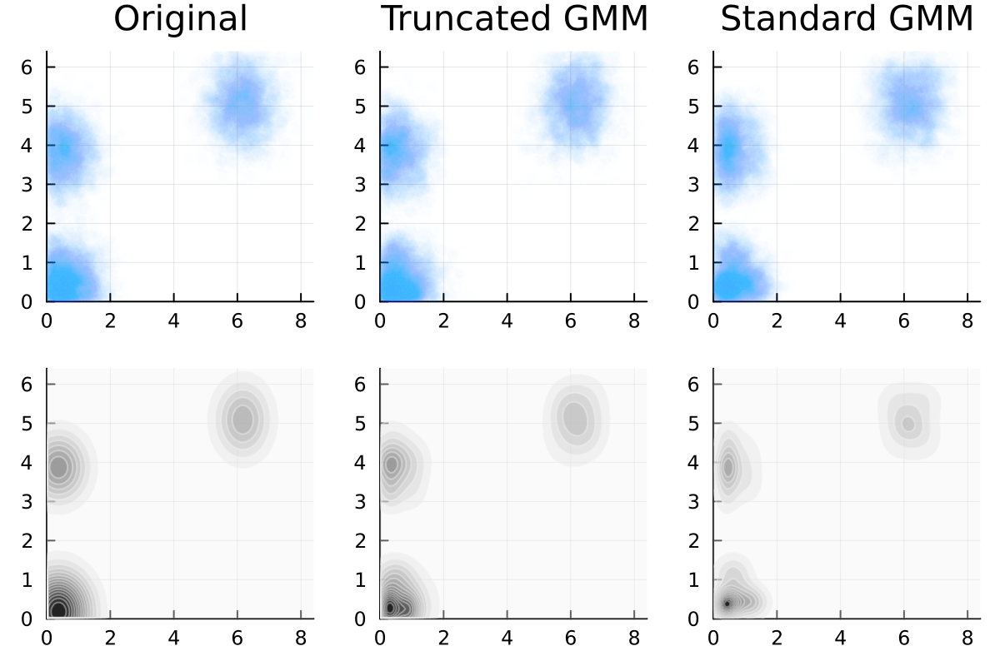

# Truncated Gaussian Mixtures

 This package allows one to fit a gaussian mixture model using Truncated Gaussian Kernels. Works only for Gaussians truncated to lie inside some box. 

> The algorithm is adapted from [this paper by Lee & Scott](https://www.sciencedirect.com/science/article/abs/pii/S0167947312001156), as well as the algorithm for computing the first two moments of a truncated gaussian with full covariances. 

## Quick Usage
The quickest no-frills way to use `TruncatedGaussianMixtures` is by using the `fit_gmm` method by specifying your data as a `DataFrame`.

```julia
using TruncatedGaussianMixtures
using DataFrames, Distributions

# Mock Data: Generate a mixture of truncated gaussian mixtures
μ1 = [0.2, 0.7]; 
Σ1 = [0.05 0.04;0.04 0.05];

μ2 = [0.1, 0.2]; 
Σ2 = [0.05 -0.02;-0.02 0.03];

a = [0.0, 0.0]; b = [1.0, 1.0] # Lower and upper limits of the bounding box

dist = MixtureModel(
    [TruncatedMvNormal(MvNormal(μ1, Σ1), a, b), 
     TruncatedMvNormal(MvNormal(μ2, Σ2), a, b)],
    [0.3, 0.7]
)

df = DataFrame(rand(dist, 80_000)', [:x, :y])

# Lets fit a 2 component Truncated Gaussian Mixture model
# with general covariance matrices, and also show a progress bar
gmm = fit_gmm(df, 2, a, b; cov=:full, tol=1e-5, progress=true);
```

## Advantages

As we can see the standard Gaussian Mixture Model has its kernels avoid the edges. A truncated kernel reproduces the probability distributions at the edges as well.





## Usage

```julia
# Create the fit
EM = fit_gmm(X, 2, a, b;   # data, n_components, lower, upper
  cov=:diag,  # Choose between :diag and :full for diagonal or full covariances
  block_structure=[1,1], # Specify the blocks that can be correlated with each other
                         # [a,a] means that the first and second dimension are in the same block
                         # Only relavent if one uses cov=:full
  tol=1e-2,   # tolerance for the stopping criteria.
  MAX_REPS=100, # Maximum number of EM update steps
  verbose=false,  # Verbose output usefull for debugging 
  progress=true,  # Gives a progress bar to show the progress of the fit
  responsibilities=false, # Returns the EM object as opposed to Distributions.jl object
  block_structure=false) # One can specify a block structure for the covariances
```
